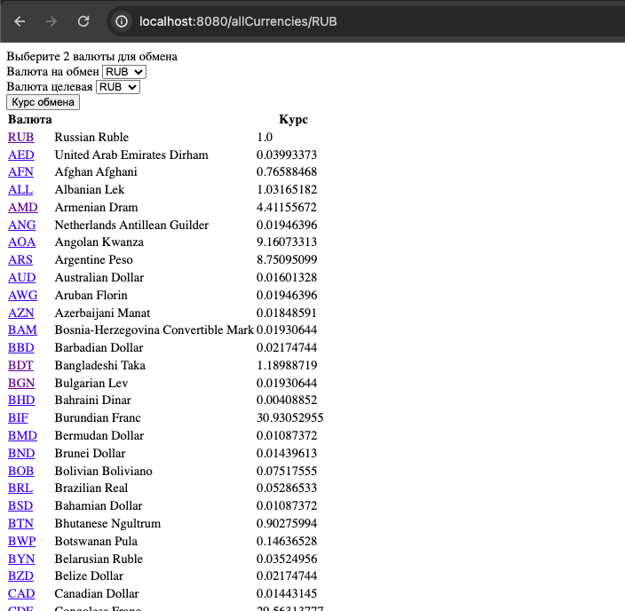
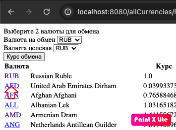
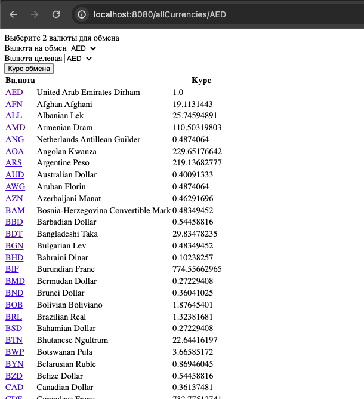
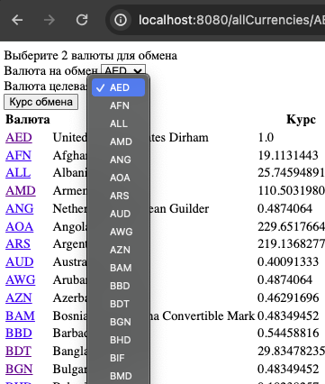
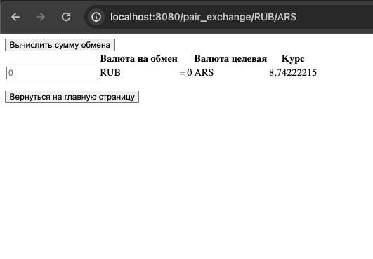

# Приложение -  получение валютных котировок

## Welcome!

Архитектура MVC, используются REST запросы на сайт https://app.exchangerate-api.com/

## Используемые технологии:

* Java 17

* Spring Boot (v2.7.3)

* Maven

* JDBC

* Lombok

### 1. Запуск приложения с maven.
Перейдите в корень проекта через командную строку и выполните команды:

```
mvn clean install
```

```
mvn spring-boot:run
```

Зайдите в браузере на стартовую страницу http://localhost:8080/allCurrencies/RUB



Появится список валют и их курс относительно рубля. Желаете список относительно другой валюты? Кликните на её код в списке:



И выйдет список относительно выбранной Вами валюты:



Вверху списка есть блок для просмотра курса между 2мя валютами. В каждом окне можете выбрать нужную валюту из списка ниже:



И будет выведена страница с курсом их обмена:



## Have a good job!